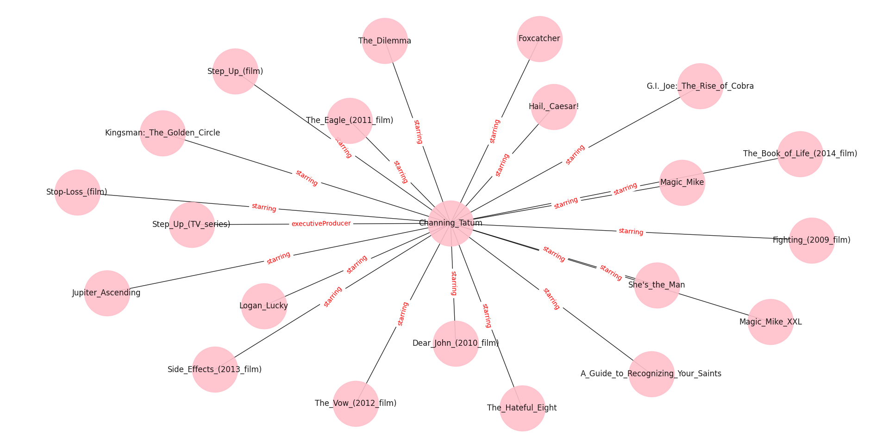
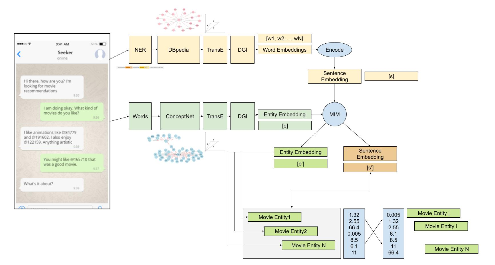

# Conversational Recommender System using Multi-Relational Data

<a align="center" href="./Report/Conversational_Recommender_Systems_using_Multi_Relational_Data.pdf">Full Report<a/>
 

  
## Introduction
  

  

The main goal of a recommender system is to solve an individual’s information overload
when trying to search for personalized recommendations. This is useful in many settings—for
instance, companies may find it essential to match their products with the right customers,
and recommender systems can help match segments of their customer base to items they are
most likely to buy. Recommendation systems have been around since the 1970s, beginning
with a computer librarian named Grundy that was built at Duke University to help students
select books by asking their preferences. In a similar manner, conversational recommender
systems today (such as that which is the focus of this project) take user utterances consisting
of preferences and output a list of recommendable items.

## Model Architecture

  

